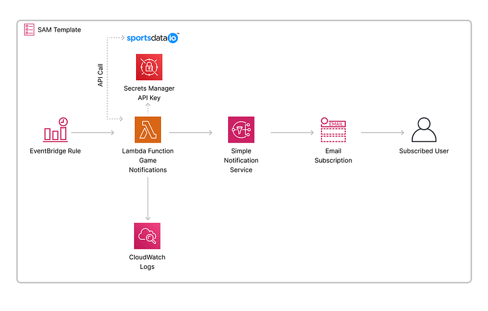
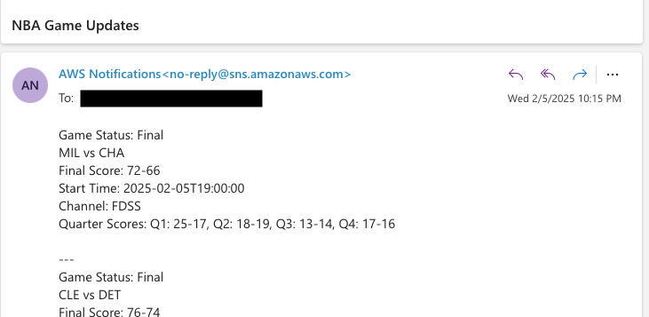

# NBA Game Day Notifications

## Project Overview
Serverless AWS application that sends NBA game notifications via email using Lambda, EventBridge, and SNS. The application fetches game data from the NBA API and delivers real-time updates through email notifications.




## Project Structure
```
├── game_day_notification/          # Lambda function directory
│   ├── app.py                     # Main Lambda handler
│   └── requirements.txt           # Python dependencies
├── events/                        # Sample events
│   └── event.json                # Test event payload
├── template.yaml                  # SAM template
├── env.json                  # SAM template
└── README.md                      # This file
```

## Prerequisites
- AWS CLI configured with appropriate permissions
- AWS SAM CLI installed
- Python 3.13
- NBA API key from sportsdata.io
- Email address for notifications

## Deployment Steps

1. Build the application:
```bash
sam build
```

2. Deploy for first time (with guided prompts):
```bash
sam deploy --guided --capabilities CAPABILITY_NAMED_IAM
```

You'll need to provide:
- Stack name
- AWS Region
- NBA API Key (will be stored securely)
- Email address for notifications

3. For subsequent deployments:
```bash
sam deploy
```

4. Confirm Verification email from AWS SES
- Check your inbox and confirm the message to start reciving emails 
## Testing


### Adding Enviroment Variables locally 
Edit the env.json with the appropriate arns for the SNS_TOPIC_ARN and NBA_API_SECRET_ARN

example
```
{
    "GameDayNotificationFunction": {
      "SNS_TOPIC_ARN": "arn:aws:sns:us-east-1:123456789:mynbanotification-GameDayTopic-eFZz7wWIxWmo",
      "NBA_API_SECRET_ARN": "arn:aws:secretsmanager:us-east-1:123456789:secret:/mynbanotification/nba-api-key-Js8PeI"
    }
  }
```




```bash
sam local invoke -e events/event.json --env-vars env.json 
```


## Architecture
- **Lambda Function**: Processes NBA game data (runs every 2 hours 9AM-2AM CT)
- **EventBridge**: Schedules function execution
- **SNS Topic**: Delivers email notifications
- **Secrets Manager**: Stores NBA API key securely

## Environment Variables
- `SNS_TOPIC_ARN`: SNS topic for notifications
- `NBA_API_SECRET_NAME`: Secret name in AWS Secrets Manager

## Security Features
- API key stored in Secrets Manager
- IAM roles with least privilege
- Limited Lambda permissions
- NoEcho for sensitive parameters

## AWS Resources Created
- Lambda Function & IAM Role
- SNS Topic & Subscription
- Secrets Manager Secret
- EventBridge Schedule
- Required IAM Policies


## Example Notification

```

